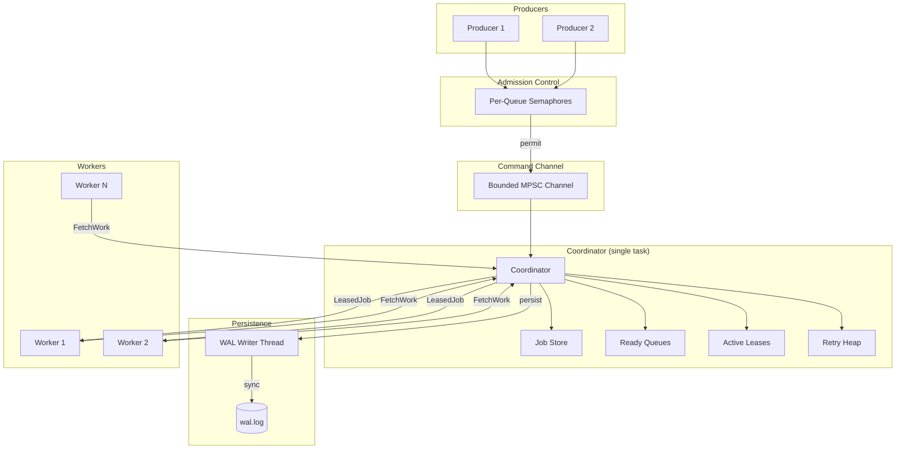
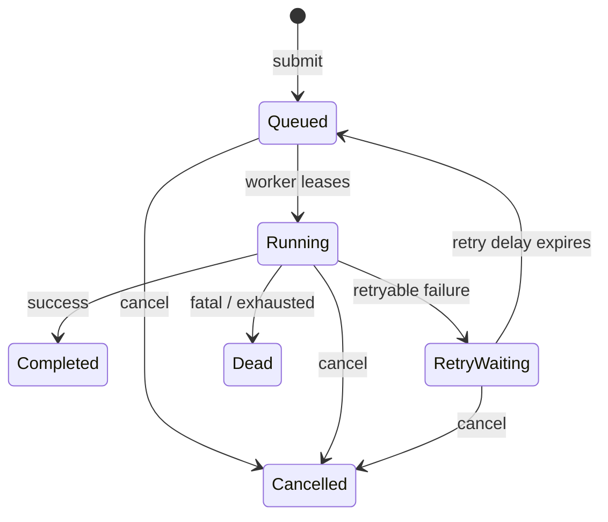

# Rust Durable Queue

A single-process durable async job queue written in Rust. Demonstrates core patterns
for building reliable background job systems: bounded backpressure, lease-based
execution, WAL durability, and crash recovery.

## Why This Project

This project demonstrates durable async systems design in Rust, including:

- State machine design for job lifecycle
- Lease-based execution with stale-outcome fencing
- Write-ahead logging with persist-before-apply ordering
- Crash recovery and truncated-tail repair
- Bounded backpressure without unbounded buffers
- Deterministic testing of concurrent systems

## Features

- Tokio async runtime integration
- Named queues with bounded capacity
- Configurable worker concurrency
- Parked workers (no polling)
- Round-robin queue scheduling (FIFO within each queue)
- Lease-based execution with stale-result fencing
- Visibility timeout for hanging jobs
- Exponential retries with configurable jitter
- Dead-letter state for exhausted/fatal jobs
- Cooperative cancellation
- Graceful shutdown with timeout
- Append-only WAL with CRC32 checksums
- Persist-before-apply durability ordering
- WAL replay and crash recovery
- Truncated-tail repair
- At-least-once execution semantics

## Quick Start

Run the demo:

```bash
cargo run --bin rdq -- demo
```

With WAL persistence:

```bash
cargo run --bin rdq -- demo --data-dir ./rdq-data
```

Inspect a WAL file:

```bash
cargo run --bin rdq -- inspect --data-dir ./rdq-data
```

Verify WAL integrity:

```bash
cargo run --bin rdq -- verify --data-dir ./rdq-data
```

## Architecture



Key ownership boundaries:
- Per-queue semaphores enforce capacity before messages enter the channel
- Coordinator exclusively owns all mutable job state
- Workers pull work and park when idle (no dispatch buffer)
- Single WAL writer thread handles all persistence

## Job Lifecycle



Crash-lost Running jobs are reconciled during recovery (re-scheduled or marked Dead).

## Durability Model

All state transitions follow persist-before-apply ordering:

```
VALIDATE → BUILD RECORD → WAL APPEND → SYNC → APPLY TO MEMORY → EXPOSE RESULT
```

This ensures:
- Jobs are not visible before durable submission
- Handlers do not run before leases are durable
- Capacity is not released before terminal state is durable

## Crash Recovery

On startup with an existing WAL:

1. Header is validated (magic bytes, version)
2. Records are scanned and validated (CRC, sequence, payload)
3. Truncated final frames are safely repaired
4. Records are replayed to rebuild in-memory state
5. Crash-lost Running jobs are reconciled:
   - Re-scheduled if attempts remain
   - Marked Dead if exhausted
6. Permits, retry timers, and ready queues are rebuilt
7. Workers start only after recovery completes

See [docs/wal-format.md](docs/wal-format.md) for format details.

## Delivery Semantics

The queue provides **at-least-once** execution.

A job may run more than once if:
1. The handler performs an external side effect
2. The process crashes before the completion record is durably written

On restart, the job executes again because no durable completion exists.

**Handlers performing external side effects should be idempotent.**

This is NOT exactly-once delivery.

## Design Decisions

- **Coordinator owns authoritative state** - No shared mutable state; all transitions
  go through the coordinator task
- **Semaphore capacity = live jobs** - Permits are held for the job's entire lifetime,
  released only on terminal state
- **Workers pull, not push** - Workers request work and park; no untracked dispatch buffer
- **Leases fence stale outcomes** - Each execution has a unique lease; old workers cannot
  affect new executions
- **Persist-before-apply** - Memory is never mutated before successful WAL sync
- **Wall-clock persisted, monotonic for scheduling** - WAL stores wall-clock timestamps;
  runtime uses monotonic time for timers

## Non-Goals

This project intentionally does not include:

- Distributed workers or networking
- HTTP/gRPC APIs
- Exactly-once delivery
- Replication or Raft consensus
- External storage (Redis, PostgreSQL, etc.)
- Workflow DAGs or cron scheduling
- Production-grade metrics/telemetry

## Usage Example

```rust
use rust_durable_queue::{
    JobContext, JobSpec, QueueConfig, QueueName, Runtime, RuntimeConfig, StorageConfig,
};
use std::time::Duration;

#[tokio::main]
async fn main() -> rust_durable_queue::Result<()> {
    let queues = vec![QueueConfig::new(QueueName::new("default")?, 100)];

    let config = RuntimeConfig::new(queues, 64)
        .with_storage(StorageConfig::Memory)
        .with_worker_concurrency(4);

    let handler = |ctx: JobContext| async move {
        println!("Processing: {}", ctx.id);
        Ok(())
    };

    let rt = Runtime::start(config, handler).await?;

    let queue = QueueName::new("default")?;
    rt.submit(queue, JobSpec::new(b"hello")).await?;

    tokio::time::sleep(Duration::from_secs(1)).await;
    rt.shutdown().await;

    Ok(())
}
```

See [examples/basic.rs](examples/basic.rs) for a complete example.

## Testing

The test suite covers:

- Concurrency and backpressure behavior
- Retry timing and exponential backoff
- Lease fencing and stale outcome rejection
- Cancellation races
- Graceful shutdown ordering
- Round-robin fairness
- WAL codec and corruption detection
- Persist-before-apply failure handling
- Restart recovery scenarios
- Truncated-tail repair

```bash
cargo test
```

## Build

```bash
cargo build
cargo test
cargo clippy --all-targets -- -D warnings
```

## License

Apache-2.0
