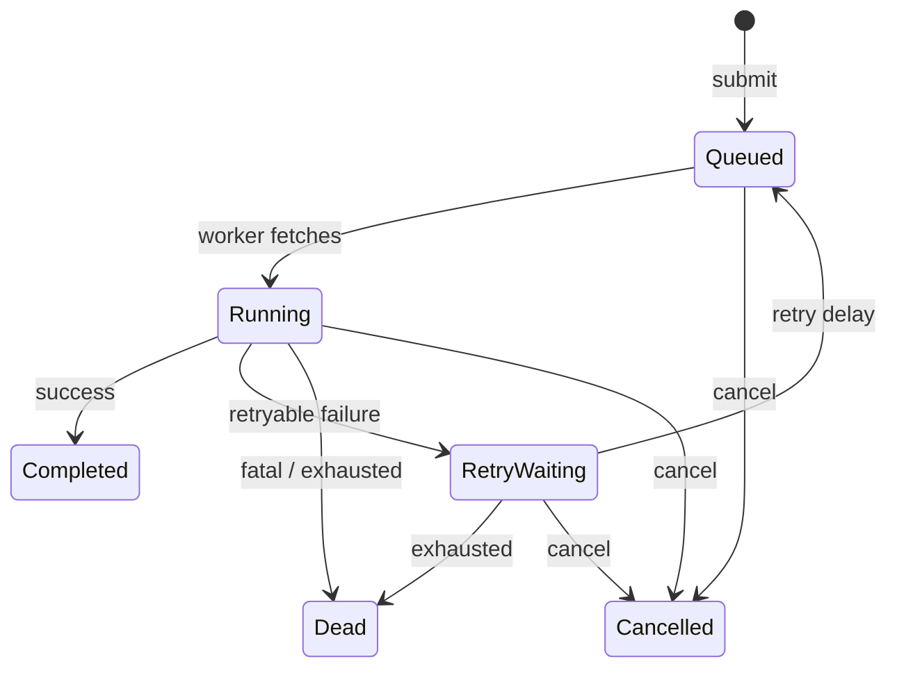
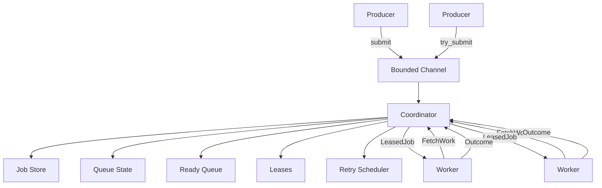

# Rust Durable Queue

A single-process async job queue written in Rust. Currently under development.

## Current Features

- Bounded named queues with configurable capacity
- Concurrent workers with configurable concurrency
- Async handler API with job context
- Leases with fencing for stale outcome rejection
- Visibility timeout for hanging jobs
- Retries with exponential backoff and jitter
- Dead-letter state for exhausted retries and fatal failures
- Cancellation of queued, waiting, and running jobs
- Graceful shutdown with cooperative cancellation
- Coordinator-owned mutable state (no shared locks)

## Job Lifecycle



## Architecture



The coordinator task exclusively owns mutable queue state. Workers request
work via bounded channels and report outcomes back. No locks are held across
await points.

## Retries

Jobs that fail with a retryable error are scheduled for retry:

- Exponential backoff: base delay doubles each attempt
- Maximum delay caps the backoff
- Configurable jitter (None or Full)
- `max_attempts` controls total allowed executions

Example: `max_attempts = 3` allows attempts 1, 2, 3 then Dead.

## Leases

Each running job has a unique lease identity (monotonic epoch). When a worker
reports an outcome, the coordinator validates the lease. Stale outcomes from
old leases (e.g., after timeout/retry) are rejected.

## Visibility Timeout

If a running job exceeds its visibility timeout:

1. The lease is invalidated
2. The job is scheduled for retry (if attempts remain)
3. Late results from the original worker are rejected as stale

## Graceful Shutdown

Calling `runtime.shutdown()`:

1. Stops accepting new submissions
2. Cancels all active leases
3. Wakes blocked submitters with ShuttingDown error
4. Workers exit their loops

Cooperative: handlers should check `ctx.is_cancelled()` for timely exit.

## Development Status

**Current step:** in-memory async job runtime with workers, leases, and retries.

Future work will add durability (WAL-based persistence).

## Build and Test

```bash
cargo build
cargo test
cargo clippy --all-targets -- -D warnings
```

## License

Apache-2.0
