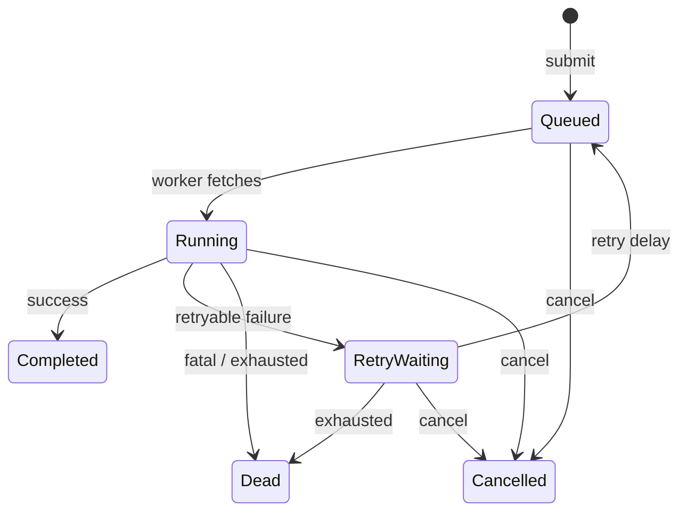
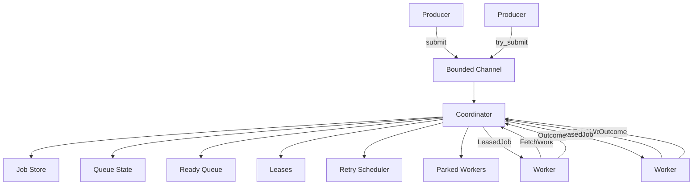

# Rust Durable Queue

A single-process async job queue written in Rust. Currently under development.

## Current Features

- Bounded named queues with configurable capacity
- Concurrent workers with configurable concurrency
- Async handler API with job context
- Leases with fencing for stale outcome rejection
- Visibility timeout for hanging jobs
- Retries with exponential backoff and jitter
- Dead-letter state for exhausted retries and fatal failures
- Cancellation of queued, waiting, and running jobs
- Graceful shutdown with configurable timeout
- Round-robin scheduling across named queues
- Parked workers (no polling)
- Coordinator-owned mutable state (no shared locks)

## Job Lifecycle



## Architecture



The coordinator task exclusively owns mutable queue state. Workers are parked
when idle (no polling) and woken immediately when work is available. Jobs are
scheduled round-robin across named queues (FIFO within each queue).

## Retries

Jobs that fail with a retryable error are scheduled for retry automatically:

- Exponential backoff: `cap = min(max_delay, base_delay * 2^(attempt-1))`
- Jitter modes:
  - `Jitter::None`: delay equals the cap
  - `Jitter::Full`: delay sampled uniformly in `[0, cap]`
- `max_attempts` controls total allowed executions

Timers fire autonomously; no external activity is required.

Example: `max_attempts = 3` allows attempts 1, 2, 3 then Dead.

## Leases

Each running job has a unique lease identity (monotonic epoch). When a worker
reports an outcome, the coordinator validates the lease. Stale outcomes from
old leases (e.g., after timeout/retry) are rejected.

## Visibility Timeout

If a running job exceeds its visibility timeout:

1. The lease is invalidated (timer fires autonomously)
2. The job is scheduled for retry (if attempts remain)
3. Late results from the original worker are rejected as stale

The coordinator wakes itself at the next deadline; no polling or external commands required.

## Graceful Shutdown

Calling `runtime.shutdown()`:

1. Stops accepting new submissions
2. Closes semaphores (blocked submitters wake with ShuttingDown)
3. Stops leasing new jobs
4. Waits up to `shutdown_timeout` for running jobs to complete
5. If all running jobs finish, shutdown completes early
6. After timeout, remaining leases are cancelled
7. Late outcomes from cancelled jobs are rejected as stale

Cancellation is cooperative: handlers should check `ctx.is_cancelled()` for
timely exit. Async tasks can be aborted, but external side effects may already
have occurred.

## Development Status

**Current step:** in-memory async job runtime with workers, leases, and retries.

Future work will add durability (WAL-based persistence).

## Build and Test

```bash
cargo build
cargo test
cargo clippy --all-targets -- -D warnings
```

## License

Apache-2.0
