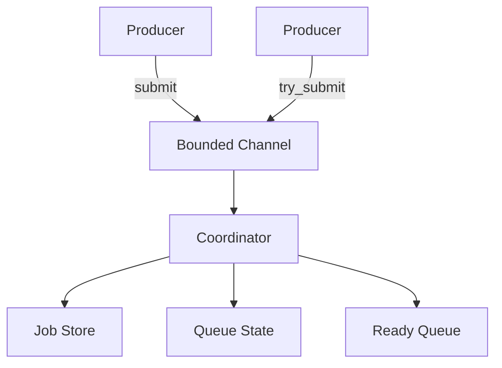

# Rust Durable Queue

A single-process async job queue written in Rust. Currently under development.

## Current Features

- Named queues with independent capacity
- Bounded capacity with backpressure
- Async submission (`submit`) with wait-for-capacity
- Non-blocking submission (`try_submit`)
- Job status lookup
- Queued job cancellation
- Coordinator-owned mutable state (no shared locks)

## Architecture



The coordinator task exclusively owns mutable queue state. Producers communicate
via a bounded mpsc channel. No locks are held across await points.

## Backpressure

Two submission methods handle capacity differently:

- `submit()` - waits asynchronously if the queue is full, proceeds when capacity
  becomes available
- `try_submit()` - returns immediately with `QueueFull` error if at capacity

## Development Status

**Current step:** in-memory async queue core.

Future work will add workers, retries, and durability (WAL-based persistence).

## Build and Test

```bash
cargo build
cargo test
cargo clippy --all-targets -- -D warnings
```

## License

Apache-2.0
